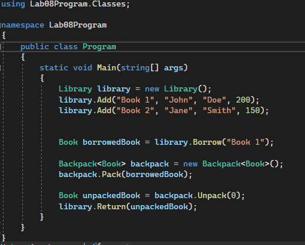
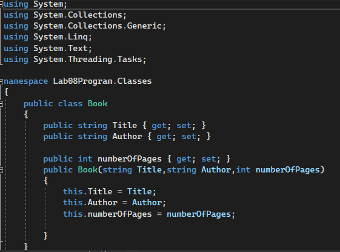

# Lab08-Phils-Lending-Library

## Summary
The Lending Library and Backpack are two classes designed to help you manage a library of books and keep track of borrowed items.
The Lending Library allows you to add books, borrow books by title, and return borrowed books.
The Backpack class is a generic class that can store any type of item and provides functionality to pack and unpack items.

---

## Visuals

**Main Method**



**Book Class**



**Libarary Class**

.PNG)
.PNG)

**BackPack Class**

.PNG)
.PNG)

---

## Usage

To use the Lending Library and Backpack classes, follow these steps:

1. Create an instance of the Library class:				
```shell
Library library = new Library();
```

2. Add books to the library using the Add method:
```shell
library.Add("Book 1", "John", "Doe", 200);
library.Add("Book 2", "Jane", "Smith", 150);
```

3. Borrow a book from the library by its title using the Borrow method. It returns the book and removes it from the library:
```shell
Book borrowedBook = library.Borrow("Book 1");
```

4. Create an instance of the Backpack class:
```shell
Backpack<Book> backpack = new Backpack<Book>();
```

5. Pack the borrowed book into the backpack using the Pack method:

```shell
backpack.Pack(borrowedBook);
```

6. Unpack a book from the backpack by its index using the Unpack method. It removes the book from the backpack and returns it:
```shell
Book unpackedBook = backpack.Unpack(0);
```

7. Return the book to the library using the Return method:
```shell
library.Return(unpackedBook);
```

---

## Other Details

* The Lending Library class implements the ILibrary interface, which provides methods to add, borrow, and return books. It also implements IReadOnlyCollection<Book>, allowing to iterate over the books in the library.
* The Backpack class implements the IBag<T> interface, which provides methods to pack and unpack items. It uses a private list to store the items.
* Both classes use generic types to provide flexibility. The Backpack can store any type of item, while the Library specifically deals with books (instances of the Book class).
* This Project Conatins xUnit testing.
